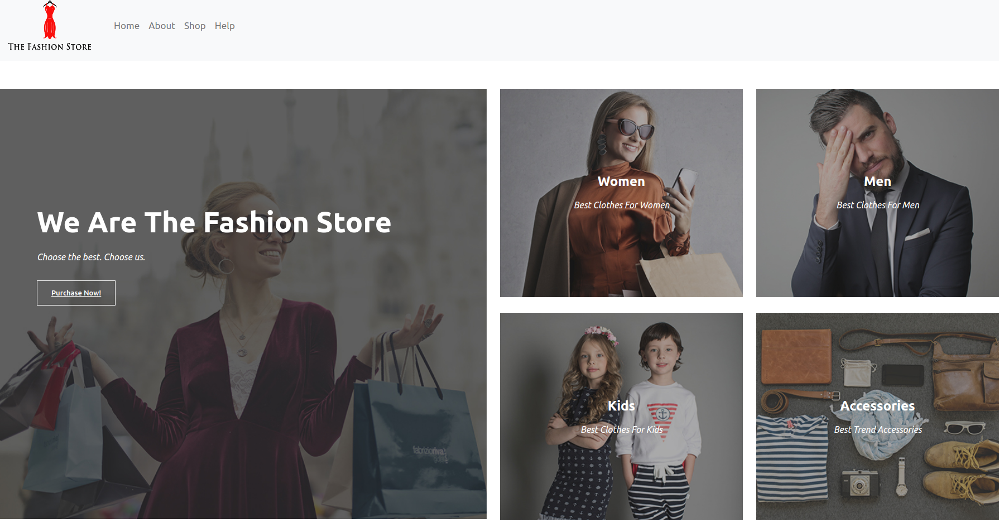
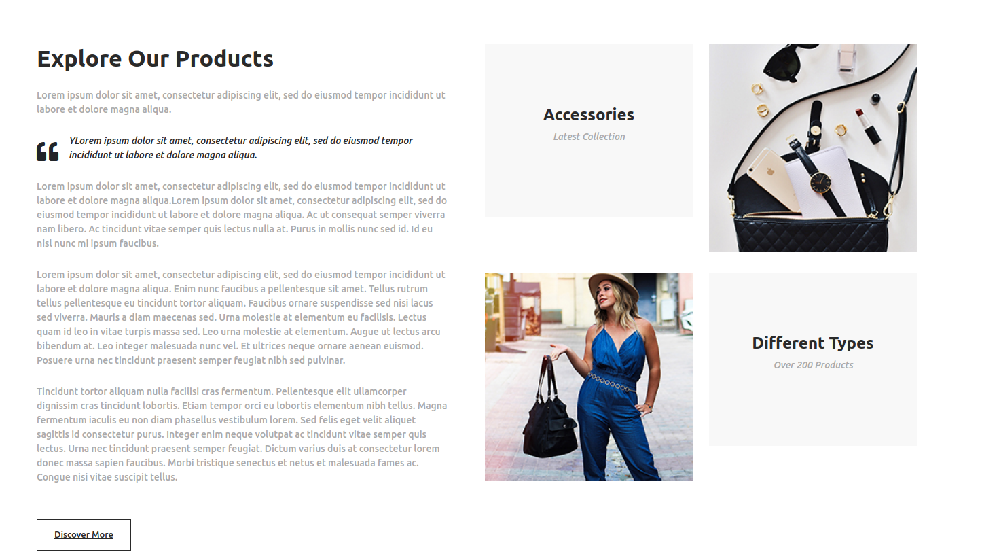
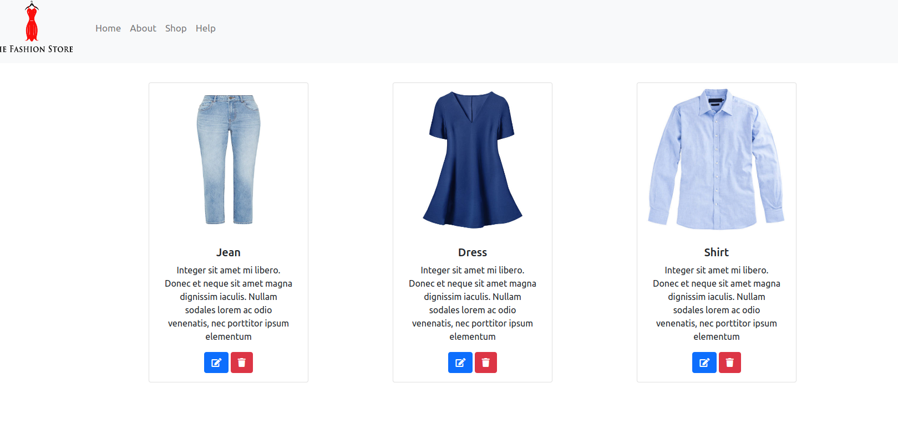
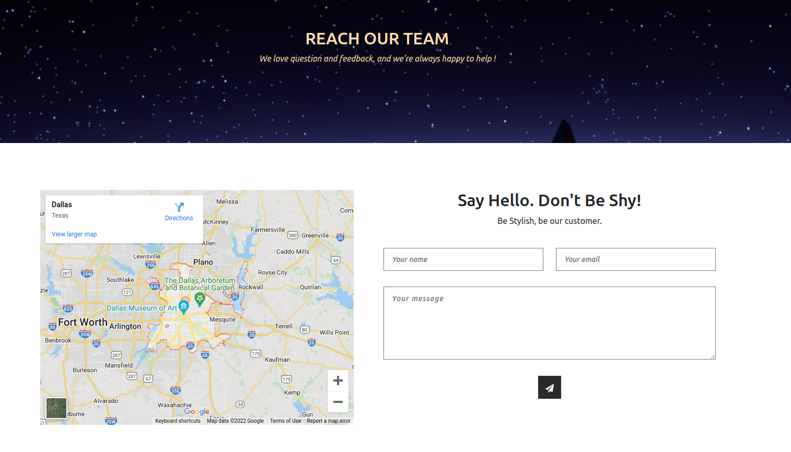
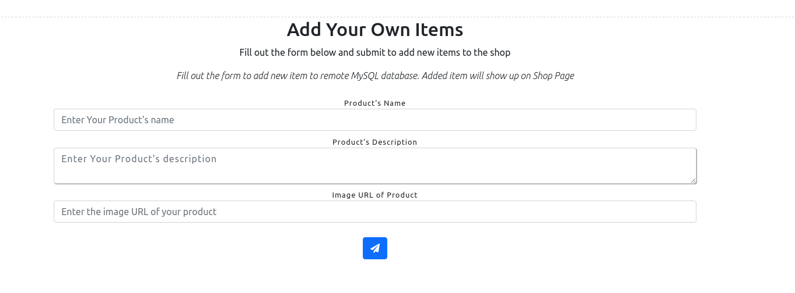
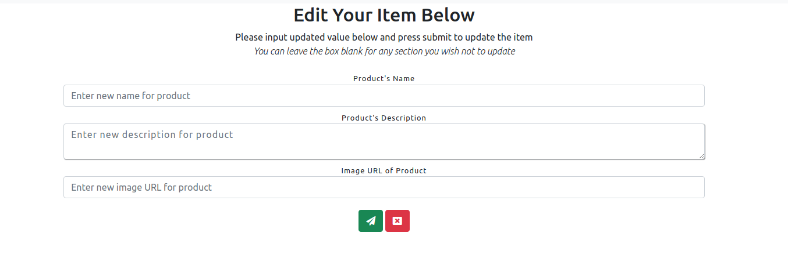

# <a href="https://thefashionstore.netlify.app/">jfs-ecommerce</a>
An ecommerce website.
Built with:
- Persistence: MySQL Database.
- Backend: REST API with Java and Spring Boot.
- Frontend: JavaScript + CSS + Bootstrap + HTML
 
<a href="https://app.moqups.com/z8XYZRXT8K1AW4d0rSd6ZxTSIv1i49gq/view/page/a0d565969">Design wireframe</a> 
Back-end repo <a href="https://github.com/txlocnguyen/jfs-ecommerce-backend">here</a> 
View back-end database <a href="https://locnguyen-ecommerce-backend.herokuapp.com/item/all">here</a>, deployed through Heroku 
Check the live website <a href="https://thefashionstore.netlify.app/">here</a>
   
# Images and Demo
## Main Home Page

      

## Shop Page
*Pull items from remote MySQL database deployed with Heroku*

      
## Help Page

      

## Add New Item Form
*Fill out the form to add new item to remote MySQL database. Added item will show up on Shop Page*

      

## Edit Item Form
*Fill out the form to edit the selected item. It's fine to leave the value blank for any section of the item you wish not to edit*
